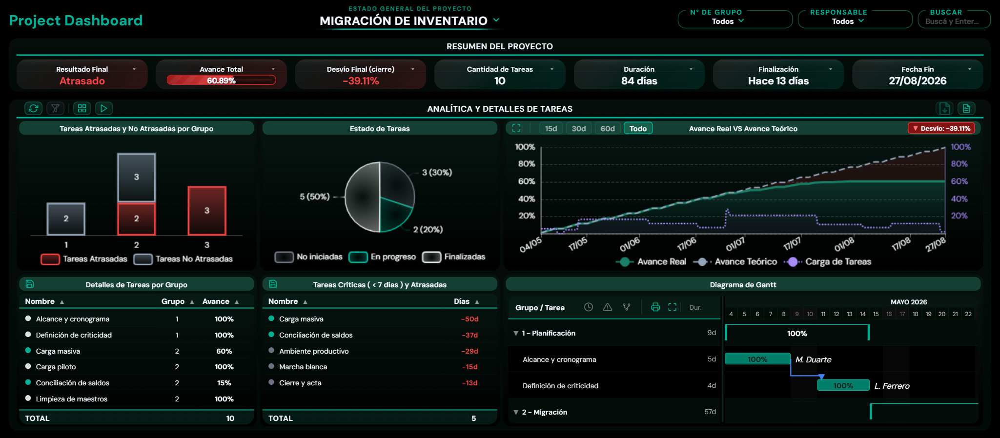

# Project Management Dashboard

A real-time multi-project tracking system that visualizes project progress, timelines, and key performance indicators in a single, unified interface.

Built at EPEC (Empresa Provincial de Energía de Córdoba) and now used by the department as its central project-control tool.

**[▶ Live demo](https://ezequielmanzur.github.io/project-management-dashboard/)**



## Scope of This Repository

This repository contains the **visualization layer** of the system: the browser application that renders the Gantt charts, S-curves and KPIs.

The upstream ETL pipeline — a Python process that reads Microsoft Project `.mpp` files through the MPXJ library and produces the unified JSON/CSV consumed here — runs on internal infrastructure and is not public. The data files in this repository are fully synthetic sample data with the same schema, so the dashboard runs standalone. Features that depend on the internal backend (task comments, executive-summary export, source-file download) are disabled in the public demo.

## Features

### 📊 Core Visualizations

- **Dynamic Gantt Charts** — Interactive timeline view with task dependencies, collapsible groups, and drag-to-reschedule
- **S-Curve Analysis** — Real vs. theoretical progress curves with automated deviation detection
- **KPI Cards** — Real-time metrics including project completion %, daily deviations, duration, and traffic light status
- **Bar Charts** — Task status breakdown by project group (completed, in progress, delayed)
- **Comparative View** — Multi-project dashboard for portfolio-level insights

### 🎯 Interactive Features

- **Cross-Filtering** — Click any visualization to filter related data across all components
- **Fullscreen Mode** — Expand any chart for detailed analysis
- **Search & Filter** — Find tasks, filter by group, and apply cascading filters
- **Presentation Mode** — Auto-cycling slideshow for stakeholder reviews
- **PNG Export** — Generate high-quality visualizations for reports

### 📈 Advanced Analytics

- Business day calculation (excludes weekends)
- Automatic delay detection and alerting
- Real-time deviation analysis (real vs. theoretical progress)
- Responsive design for desktop and tablet displays

## Tech Stack

| Component           | Technology                           |
| ------------------- | ------------------------------------ |
| **Frontend**        | Vanilla JavaScript, HTML5, CSS3      |
| **Charts**          | ECharts (interactive visualizations) |
| **Export**          | html2canvas (PNG generation)         |
| **Data Processing** | PapaParse (CSV), custom JSON         |
| **Design**          | DM Sans typography, dark theme       |

Upstream (not in this repository): Python, MPXJ via JPype, pandas, Flask.

## Project Structure

```
project-management-dashboard/
├── index.html                    # Main application UI
├── styles.css                    # Dashboard styling & theming
├── script.js                     # Frontend logic & interactivity
├── Proyectos_Unificados.json     # Sample project-level metrics
├── Proyectos_Unificados.csv      # Sample task-level data
├── README.md                     # This file
└── .gitignore                    # Git exclusions
```

## Getting Started

### Option 1: Direct Browser

1. Clone this repository:
   ```
   git clone https://github.com/EzequielManzur/project-management-dashboard.git
   ```
2. Open `index.html` in a modern web browser
3. Load sample data or connect to your data source

### Option 2: Local Server

For CORS and dynamic data loading, run a simple HTTP server:

```
# Python 3
python -m http.server 8000

# Node.js (if installed)
npx http-server
```

Then open `http://localhost:8000` in your browser.

## Usage

1. **Select a Project** — Choose from the dropdown to filter data
2. **Search Tasks** — Use the search bar for quick task lookup
3. **Filter by Group** — Isolate specific task groups
4. **Explore Charts** — Click elements to cross-filter across visualizations
5. **Export** — Download PNG snapshots for presentations or reports
6. **Present** — Activate presentation mode for stakeholder reviews

## Data Format

### Project-level JSON

```json
[
  {
    "ID Proyecto": "Project Alpha",
    "Cantidad Tareas": 24,
    "% Avance Total": "52.30%",
    "Duración Proyecto": 85,
    "Tareas Atrasadas": 4,
    "Tareas Criticas": 6
  }
]
```

### Task-level CSV

```
ID Proyecto,Nombre de tarea,Duración,Comienzo,Fin,% completado,Grupo_ID,Grupo_Nombre
Project Alpha,Phase 1 Setup,5,2024-06-15,2024-06-19,100,1,Planning & Setup
```

## Key Design Decisions

### Business Day Calculation

Working-day math excludes weekends and configurable holidays, so duration metrics match how the schedule is actually planned rather than raw calendar days.

### Deviation Analysis

The S-curve compares real vs. theoretical progress, with a traffic-light threshold:

- **Green** (0–5% deviation) — On track
- **Yellow** (5–15% deviation) — Minor delays
- **Red** (>15% deviation) — Critical delays

### Real-Time KPIs

All metrics recompute when source data changes, so the dashboard stays accurate without page reloads.

## Performance

- Handles 1000+ tasks efficiently
- Real-time filtering with sub-100ms response times
- Optimized rendering for large Gantt charts

## Customization

### Change Sample Data

1. Replace `Proyectos_Unificados.json` with your own project metrics
2. Replace `Proyectos_Unificados.csv` with your task details
3. Ensure column names match the schema above

### Modify Colors

Edit the CSS variables in `styles.css`:

```css
:root {
  --epec-verde-oscuro: #006D59;
  --epec-verde-epec: #197F66;
  --epec-verde-brillante: #00B095;
  /* ... */
}
```

### Adjust Refresh Rate

In `script.js`, modify the data fetch interval in the `actualizarDatos()` function.

## Browser Support

Chrome, Firefox, Safari, Edge (latest versions).

## Known Limitations

- Requires a modern browser with ES6 support
- Large datasets (>5000 tasks) may show performance degradation
- The S-curve requires consistent date formatting (YYYY-MM-DD)

## License

MIT License — free to use for personal or commercial purposes.

## Contributions

Found a bug or have a suggestion? [Open an issue](https://github.com/EzequielManzur/project-management-dashboard/issues).

## Author

**Ezequiel Elías Manzur**
Advanced Industrial Engineering student (UTN-FRC) — data analysis and internal tools

- **LinkedIn**: [linkedin.com/in/ezequielmanzur](https://linkedin.com/in/ezequielmanzur)
- **GitHub**: [@EzequielManzur](https://github.com/EzequielManzur)

---

**Version**: 1.0.0
